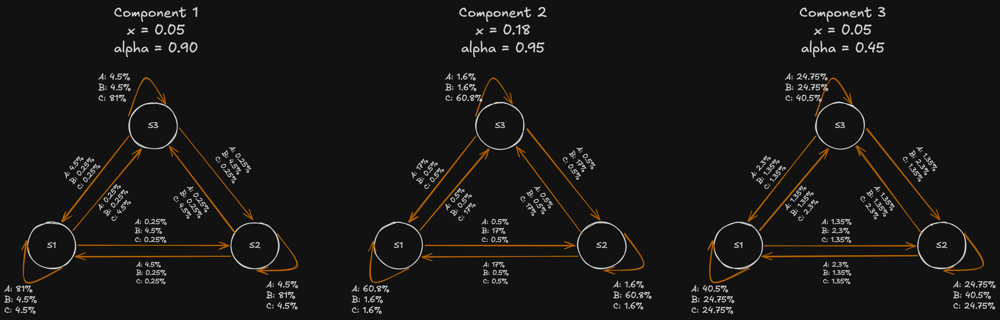
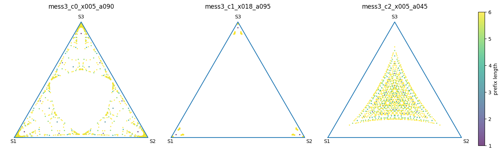
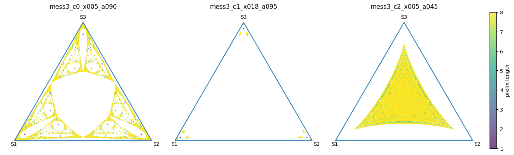
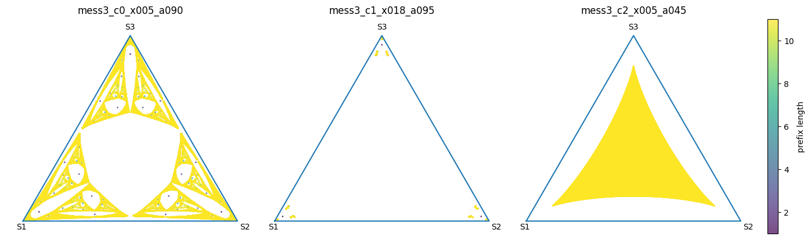
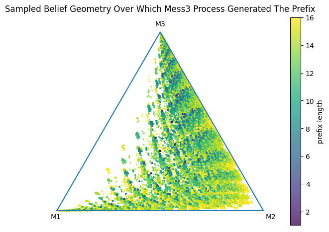

For Simplex takehome, building a dataset where each entry is a sample from one of 3 Mess3 processes (a type of Hidden Markov Model with 3 states), training a transformer on it and seeing if the resulting residual stream contains belief state geometry similar to what we would predict.

## Chosen Mess3 Processes
1. x = 0.05 and α = 0.90
2. x = 0.18 and α = 0.95
3. x = 0.05 and α = 0.45

This parameter choice was selected to improve component identifiability at sequence length 16, rather than to reproduce the strongest Sierpinski-like self-similarity seen in some single-process Mess3 settings. I therefore expect the resulting belief geometries to be structured but not necessarily equally fractal-looking across components.

Each sequence emits tokens A, B or C

## Belief Targets And Notation

Let $M ∈ {1,2,3}$ denote which Mess3 process generated the sequence, let $z_t ∈ {S1,S2,S3}$ denote the hidden state at position $t$, and let $x_t ∈ {A,B,C}$ denote the observed token.

For a fixed process, I track the hidden-state beliefs
- $b_t = P(z_t | x_{<=t})$
- $q_{t+1} = P(z_{t+1} | x_{<=t})$

using the row-vector update
- $b_t(i) ∝ q_t(i) E_{i,x_t}$
- $q_{t+1} = b_t A$

I also track the process-identity belief
- $P(M = m | x_{<=t}) ∝ P(x_{<=t} | M = m) P(M = m)$

where the likelihood under each process is computed exactly by Bayesian filtering / the forward algorithm.

Each of these is a 3-probability vector summing to 1, so each can be plotted on a 2-simplex.

### Hidden Markov Models Representing The Mess3 Processes

### Belief State Geometry Of "Which State Am I In?" Of Each Mess3 Process Depending On Prefix Length (Sampling)
We can depict the belief state (probability of being in state 1, 2 or 3 at a given point) as a point on a 2-simplex (triangle) over each prefix of a given sequence. We can plot this for many sequences to obtain the belief state geometry:

With 6 token sequences

With 8 token sequences

With 11 token sequences

### Belief State Geometry Of Sampling On "Which Mess3 Process Generated This Sequence?"

## Planned Readout Analysis

After training, I will extract residual-stream activations at each prefix and fit linear or affine readouts into the exact Bayes belief targets above. The main target will be $q_{t+1} = P(z_{t+1} | x_{<=t})$, since the model is trained for next-token prediction. I will also test readouts into $P(M | x_{<=t})$ to study whether the model explicitly tracks process identity.

## Preregistered Predictions

### P0: Hidden-state beliefs will be linearly decodable from the residual stream
A linear or affine map from residual activations to the exact Bayes hidden-state belief vectors should recover a geometry similar to the ground-truth simplex plots.

#### P0.0.0. This will be with the last layer of residual stream

#### P0.0.1. (alternative, low likelihood) last layer won't be enough, but a concatenation of all layers of the residual stream at a given prefix will contain this projectable value

#### P0.1. Activations will organize more like a union of component-specific hidden-state belief geometries than like one single shared geometry
Each will probably look like what our ground truth projections show

#### P0.2. Alternative: the network may learn partially shared or factorized coordinates
A single global geometry may still work reasonably well if the network separates “which process am I in” from “which hidden state am I in” in different directions of representation.

I give this a lower but non-negligible likelihood. On one hand, the belief states are quite different from each other so one structure should not fit them.

On the other hand, while they do produce different token outcomes, such that with perfect Bayesian inference, "Which Mess3 Process Generated These 16 Tokens?" is answerable on average with 65% certainty, this might not be a strong enough pressure to force differentiation.

Had their underlying belief state geometries been closer, I would consider this much more likely.

### P1: Process-identity beliefs will also be linearly decodable and trace a 2-simplex over {M1, M2, M3}
I expect the residual stream to contain a decodable approximation to $P(M | x_{<=t})$, and for this process-belief geometry to resemble the sampled ground-truth process-simplex plot.

#### P1.1: Later context positions will be more certain of which process is generating this run compared to earlier context positions

#### P1.2: In the residual stream's extracted beliefs, certainty in process being the second or the third will be high more often than certainty of the first, due to how ground truth probabilities are

#### P1.3. The process-belief geometry will be skewed rather than uniformly filling the simplex
Because the three chosen processes are not equally easy to distinguish from typical sampled prefixes, I expect the reachable process-belief states in activation space to concentrate in a non-uniform region of the simplex, just as in our ground-truth probabilities chart.

### P2: I expect that early in training, a factorized view or even directly assuming a single Mess3 process behind the tokens will be assumed, and later the model will shift to representing each separately
I will attempt to capture this during training, or to retrain the model afterward with same hyperparams if I fail to capture it the first time due to not looking at the right place.
I will treat this as a training-dynamics prediction: earlier checkpoints should be better explained by simpler or more shared readouts, while later checkpoints should show stronger separation between process-specific and hidden-state-specific structure.

## What Would Count Against These Predictions
Evidence against these predictions would include:
- poor linear decodability of exact Bayes beliefs from later residual activations
- no clear increase in certainty with context position
- no advantage of later layers over earlier layers
- no meaningful decodability of $P(M | x_{<=t})$
- activation geometries that fail to resemble the corresponding ground-truth belief geometries even qualitatively

## Results
Available [here](writeup/takehome_writeup.md)
