# MATS Simplex Takehome

## Overview

I study a non-ergodic dataset formed by mixing three Mess3 hidden Markov processes across sequences. Each length-16 sequence is generated entirely by one component, and all components share the same visible alphabet `{A, B, C}`. A small causal transformer is trained by next-token prediction, and its residual-stream activations are compared to exact Bayes belief targets.

The main question is whether the learned internal geometry reflects:

- hidden-state belief within a component
- process-identity belief over which component generated the sequence

## Choosing The Mess3 Components

Choosing the three Mess3 processes was part of the experiment, not just a setup detail. I wanted the components to share the same visible alphabet so that the latent-inference problem would remain nontrivial, but I also needed the three processes to be distinguishable enough that a length-16 sequence contained meaningful evidence about which component generated it.

This meant giving up on reproducing the most visually Sierpinski-like single-process regime and instead optimizing for a cleaner multi-process inference problem. I fixed

- `c0 = (x=0.05, alpha=0.90)`

as a baseline sticky, fairly informative component, and then searched over candidate `c1` and `c2` values using an exact Bayes component-identifiability diagnostic. For each candidate triple, I sampled sequences of length 16, computed the posterior over components `P(M | x_<=16)` by exact forward filtering, and ranked parameter choices by their final component posterior quality.

The search consistently favored:

- a sharper, faster-switching `c1`
- a much noisier `c2`

with top candidates clustered around:

- `c1` near `(x=0.18, alpha=0.95)`
- `c2` near `(x in {0.03, 0.05, 0.07, 0.09}, alpha=0.45)`

I chose the final set

- `c0 = (0.05, 0.90)`
- `c1 = (0.18, 0.95)`
- `c2 = (0.05, 0.45)`

because it kept `c0` and `c2` matched in transition dynamics, making that comparison primarily an emission-noise contrast. Under exact Bayes inference on length-16 prefixes, this choice gave:

- average max component posterior at $t=16$: `0.735`
- average true-component posterior at $t=16$: `0.643`

These values are far from trivial but high enough to make component identity a real latent variable for the model to infer.

## Ground-Truth Belief Geometry

For a fixed component, I track:

- $b_t = P(z_t \mid x_{\le t})$ (`filtered_after_obs`)
- $q_{t+1} = P(z_{t+1} \mid x_{\le t})$ (`predictive_next`)

using the row-vector update

- $b_t(i) \propto q_t(i) E_{i, x_t}$
- $q_{t+1} = b_t A$

I also track process identity:

- $P(M = m \mid x_{\le t}) \propto P(x_{\le t} \mid M = m) P(M = m)$

The setup notebook showed that the reachable hidden-state geometry is already structured before any model is trained. Sampling prefixes of increasing length produces progressively richer subsets of the simplex:

The same exact Bayes machinery also gives a ground-truth simplex over process identity:

These plots provide the target geometries against which I later compare decoded activations.

## Model And Training Setup

- Dataset size: 30k train / 3k val / 3k test, balanced across components
- Sequence length: 16
- Model: 2-layer pre-LN causal transformer with `d_model=64`, 2 heads, and `d_mlp=256`
- Objective: next-token prediction on all 15 model-visible positions

I ran the experiment twice:

- primary run with seed `42`
- confirmation run with seed `50`

The seed-42 run is the source of the headline metrics below. The seed-50 run reached its best checkpoint at epoch `15` and is used as a qualitative robustness check, especially for the new component-conditioned visualizations.

## Prediction Quality

In the primary seed-42 run, the best checkpoint was epoch `21`. The model came very close to the exact Bayes next-token baseline on held-out data:

| Metric | Value |
| --- | ---: |
| Best epoch | 21 |
| Val NLL | 0.9488 |
| Test NLL | 0.9519 |
| Bayes val NLL | 0.9465 |
| Bayes test NLL | 0.9495 |

This indicates that the transformer learned most of the predictive structure available in the dataset.

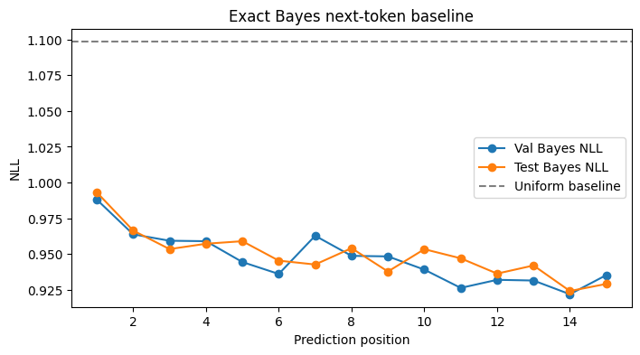

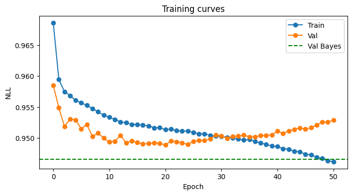

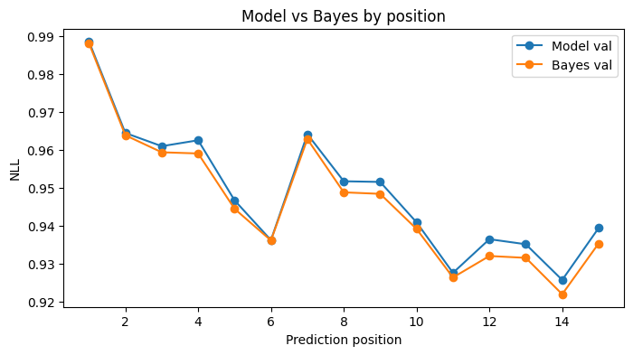

## Hidden-State And Process Beliefs At The Best Checkpoint

At the best checkpoint, block-2 residual activations support strong linear decoding of both hidden-state belief and process identity. A compact summary of the overall decoded geometry is:

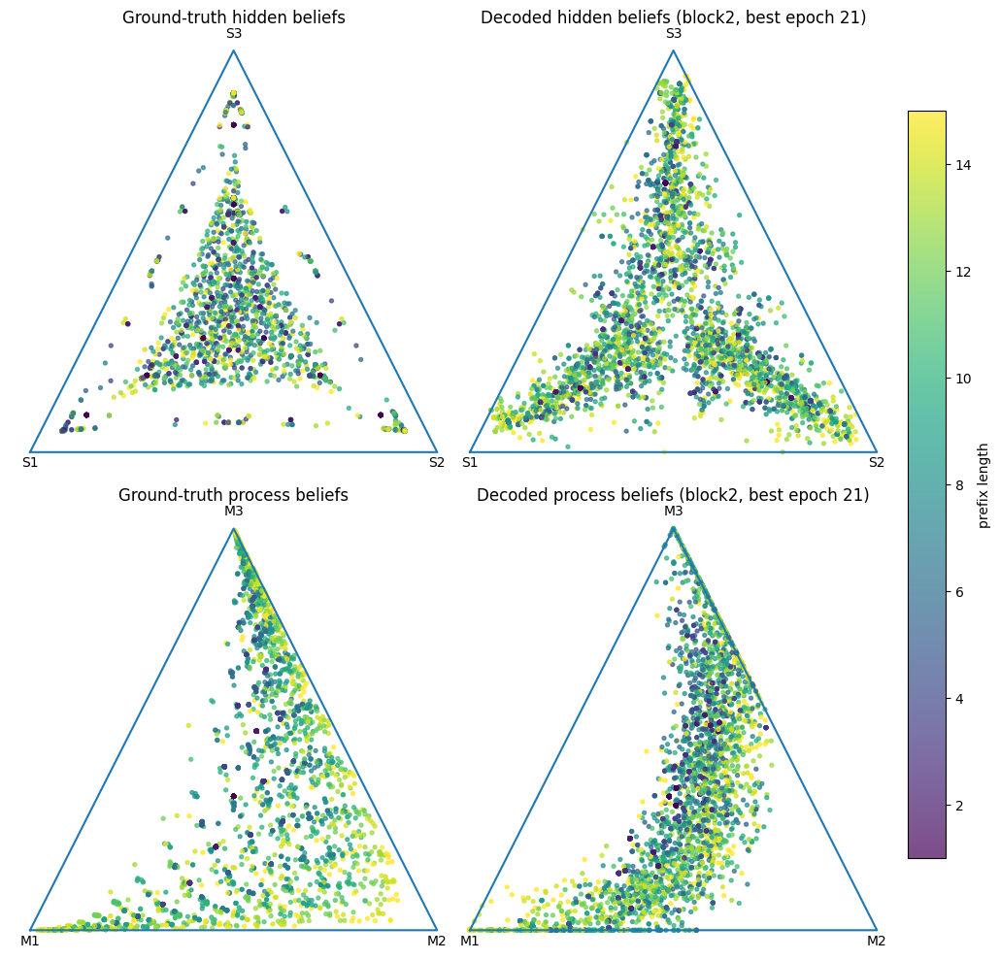

For hidden-state belief, the most important quantitative result is the gap between one global readout and separate per-component readouts:

| Readout target | Block2 $R^2$ |
| --- | ---: |
| Hidden belief, global linear readout | 0.864 |
| Hidden belief, per-component linear readouts (avg) | 0.943 |
| Process belief, global linear readout | 0.817 |

By true component over all model-visible prefixes:

| Component | Hidden global $R^2$ | Hidden per-component $R^2$ |
| --- | ---: | ---: |
| `mess3_c0_x005_a090` | 0.917 | 0.976 |
| `mess3_c1_x018_a095` | 0.841 | 0.997 |
| `mess3_c2_x005_a045` | 0.301 | 0.853 |

The noisy component `c2` is the clearest case where a single shared hidden-state map underperforms, while a per-component map still recovers the target well. That strongly suggests that the learned hidden-state geometry is at least partly component-specific.

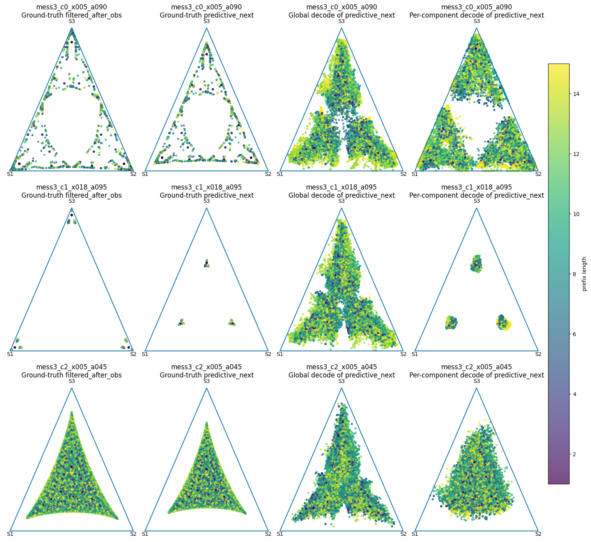

The final-prefix view is consistent with the same story:

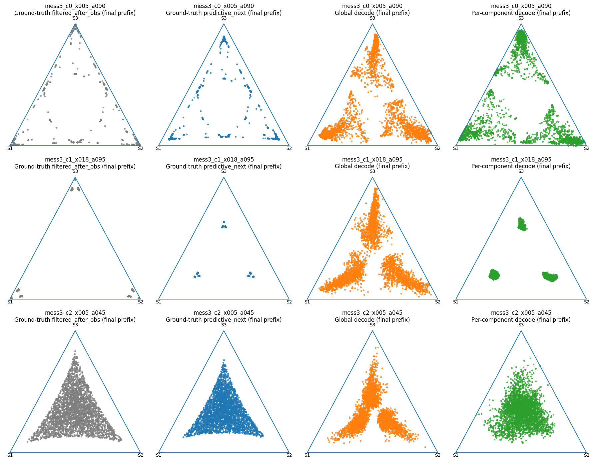

Process identity behaves differently. It is weakly decodable in embeddings, improves in block 1, and becomes strongly decodable in block 2, which supports the claim that the network learns a representation of $P(M \mid x_{\le t})$ rather than merely tracking within-process hidden state.

## Additional Analysis: Global Versus Per-Component Readouts

My main additional analysis compares one global linear readout against separate per-component linear readouts.

I chose this because it directly tests whether the learned geometry is shared across components or partly component-specific. One global readout asks whether the network uses one common coordinate system for all hidden-state beliefs. Separate per-component readouts ask whether each component is internally clean but represented in somewhat different coordinates.

The result is asymmetric:

- hidden-state belief is much better decoded by separate per-component linear maps than by one global map
- process identity is well decoded by one global linear map

This points to a partially factorized representation:

- shared-ish coordinates for "which process am I in?"
- more component-specific coordinates for "what hidden-state belief do I have within this process?"

That is more interesting than either extreme of fully separate manifolds or one fully shared hidden simplex.

## Training Dynamics

The training-dynamics story requires some care. If I fit a fresh linear probe separately at each checkpoint, I get the following block-2 summary in the seed-42 run:

| Checkpoint | Hidden global $R^2$ | Hidden per-component $R^2$ | Process global $R^2$ |
| --- | ---: | ---: | ---: |
| init | 0.811 | 0.938 | 0.194 |
| epoch 1 | 0.846 | 0.898 | 0.466 |
| epoch 15 | 0.864 | 0.935 | 0.808 |
| epoch 29 | 0.863 | 0.941 | 0.795 |
| epoch 43 | 0.856 | 0.925 | 0.739 |
| best (epoch 21) | 0.864 | 0.943 | 0.817 |

The checkpoint-quality curves summarize that trend:

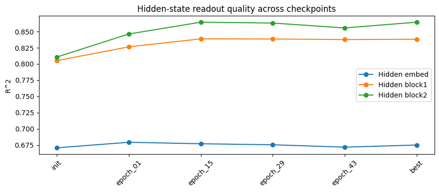

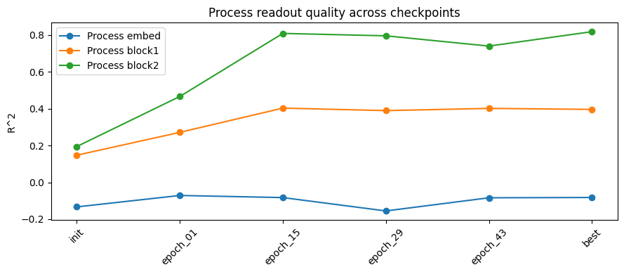

Taken naively, the checkpoint-by-checkpoint probes make hidden belief look highly decodable even at initialization. I do **not** interpret that as evidence that the untrained model already performs correct belief updates. A safer interpretation is that hidden-state targets are strongly correlated with local token evidence, especially in the high-alpha components, and that a fresh probe can recover part of that local signal from random token and positional features.

To test whether the **learned geometry itself** is present early, I also apply the fixed best-checkpoint extractor back to earlier checkpoints. That is a much stricter test, and it shows that the final learned geometry is not simply present in the random network from the start. The pooled process-belief checkpoint grid looks like this:

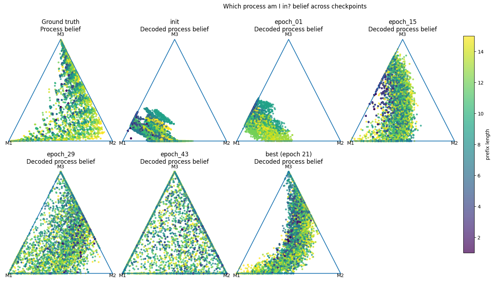

The overall lesson is:

- fresh probes can recover some local hidden-state signal from early random features
- aligned block-2 geometry for both hidden belief and process belief emerges through training
- process identity is the clearest thing the model learns strongly from scratch

## Second Seed Check

I reran the experiment with seed `50` as a qualitative robustness check. The best checkpoint in that run occurred earlier, at epoch `15`, but the overall representational story remained the same: process identity sharpened through training, while component-conditioned visualizations still showed that hidden-state decoding is cleaner with per-component readouts than with a single shared hidden-state map.

The seed-50 run is especially useful for the new component-conditioned process-belief grids. Looking only at sequences that were truly generated by a given component makes it easier to see how the process posterior evolves for that subpopulation:

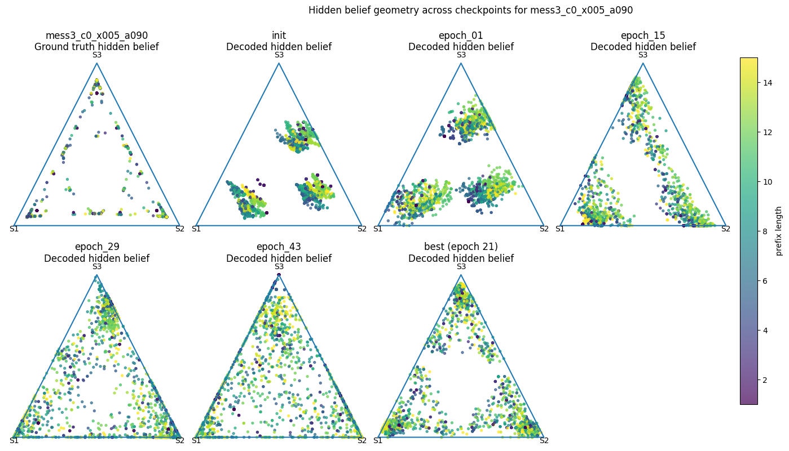

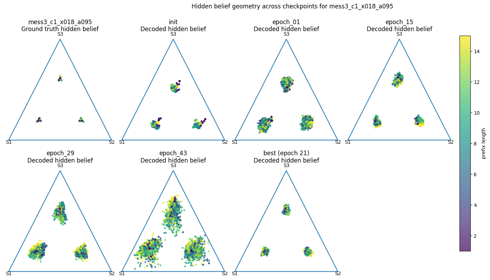

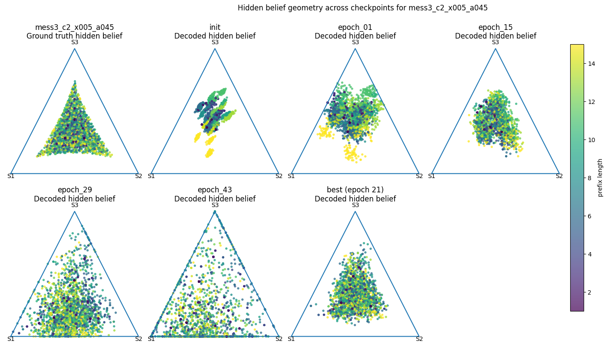

Taken together, the seed-42 and seed-50 runs suggest that the main conclusions are not an artifact of a single random seed. The exact best epoch moves, but the qualitative geometry story is stable.

## Assessment Of Preregistered Predictions

### P0: Hidden-state beliefs will be linearly decodable from the residual stream

Supported. Later residual activations, especially in block 2, decode hidden-state belief strongly.

### P0.1: Activations will organize more like a union of component-specific hidden geometries than one shared geometry

Supported. Per-component hidden readouts outperform the global hidden readout by a meaningful margin, especially on the noisy component `c2`.

### P0.2: Alternative factorized/shared representation

Partially supported. The model does not use one fully shared hidden-belief geometry, but the process-belief results suggest shared factorization does exist. The best interpretation is neither fully separate nor fully shared, but partially factorized.

### P1: Process-identity beliefs will also be linearly decodable

Supported. Block-2 activations support strong global decoding of $P(M \mid x_{\le t})$, and the decoded process-belief geometry qualitatively matches the skewed ground-truth process simplex.

### P2: Training will move from simpler/shared structure toward separated process-specific structure

Partially supported, with an important revision. A fresh probe can recover some hidden-belief signal even at initialization, but the fixed best-checkpoint extractor and the checkpoint grids show that the learned geometry itself is not present at init and emerges through training. The strongest training effect is on sequence-level component inference.

## Conclusion

This experiment shows that a small transformer trained on a non-ergodic mixture of Mess3 processes can learn near-Bayes-optimal next-token prediction while developing residual-stream geometry that reflects both hidden-state belief and process identity. The representation is not best described as one completely shared simplex or three completely separate manifolds. Instead, it appears partially factorized: process identity is decoded well by a global linear map, while hidden-state belief is decoded much better by per-component maps.

The parameter search, the primary seed-42 run, and the qualitative seed-50 rerun all point to the same conclusion: this non-ergodic Mess3 mixture supports a meaningful latent-inference problem, and the transformer's residual stream learns geometry that tracks that structure.
